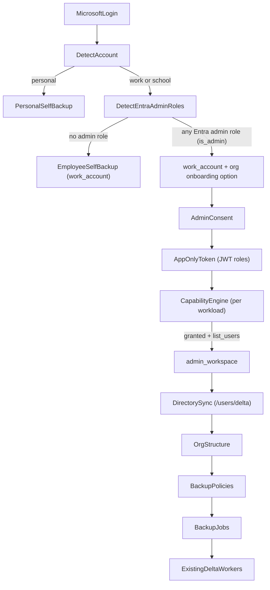

# Microsoft 365 backend plan (Satellite and Backup-Tools kept separate)

Backend-only plan for the Microsoft 365 personal/employee/admin backup flow. The Satellite (StorXMonitor) and Backup-Tools work are planned separately, and both reuse the tables, policies, org-unit flow and delta workers Google already shares. The Satellite needs no database migration; Backup-Tools adds two tables.

**This repo (Backup-Tools) implements Part B.** Part A (Satellite) is implemented first in the StorXMonitor repo (`/home/dhaval/Desktop/StorXMonitor`) and is included here only for reference. Satellite file paths in Part A are relative to that repo.

## Target flow and who owns each part



Each piece of data has exactly one owner, so the duplicated state that drifted last time can't come back:
- **Satellite:** user, session, project, onboarding step, user and tenant identity, the Microsoft credential (refresh token, `account_type`, `tenant_id`, `tenant_name`), and the OAuth / admin-consent callback state (HMAC). These columns already exist in `backup_credentials`, so the Satellite needs **no migration**.
- **Backup-Tools:** admin roles, consent status, granted application permissions, capabilities, directory users, org structure, the directory delta link, policies, jobs and delta cursors.
- The Satellite is never the authority for consent or capabilities. It only signs and verifies the **callback state** that protects the admin-consent redirect, then passes Backup-Tools' authoritative response through unchanged.
- **Out of scope for this plan:** restore. Restore OAuth and its ReadWrite scopes stay as they are today.

### Authorization rule
`account_type` is only a user-facing label and is never used to authorize anything. Organization backup is allowed only when all of these hold:
- the job's `auth_mode` is `application`;
- the tenant's consent status is `granted`;
- an app-only token can be obtained for the tenant;
- `list_users` is true;
- the capability for each requested service is true.

## Permissions

**Delegated (login).** Use only scopes a normal user can approve:
- `openid profile email offline_access User.Read Mail.Read Calendars.Read Contacts.Read Files.Read`
- The Satellite and Backup-Tools must use this one shared list.
- This drops `User.Read.All`, `Directory.Read.All` and `Group.Read.All` from the delegated scopes in the Satellite's `satellite/console/consoleweb/consoleapi/socialmedia/microsoft.go` (`MicrosoftBackupScopes`).

**Application (admin consent).** Each capability needs:
- `list_users`: `User.Read.All`
- `mail_backup`: `Mail.Read`
- `calendar_backup`: `Calendars.Read`
- `contacts_backup`: `Contacts.Read`
- `onedrive_backup`: `Files.Read.All`
- `sharepoint_backup`: `Sites.Read.All`
- `teams_channel_backup`: `Group.Read.All`, `Channel.ReadBasic.All`, `ChannelMessage.Read.All`
- `groups_backup`: `Group.Read.All`

Admin-role detection needs no application permission. It uses the user's own token through the `wids` claim and `checkMemberObjects`.

## Shared contract (Backup-Tools produces it, the Satellite passes it through unchanged)

```json
{
  "account_type": "personal|work_account|admin_workspace",
  "workspace_kind": "personal|organization",
  "tenant_id": "", "tenant_name": "",
  "is_admin": false, "admin_roles": [],
  "consent": {"status": "not_requested|granted|insufficient|revoked|auth_error", "consented_by": "", "consented_at": "", "granted_roles": [], "last_error": ""},
  "capabilities": {"list_users": false, "mail_backup": false},
  "capability_errors": {"teams_channel_backup": {"code": "missing_role|not_provisioned|forbidden|temporary", "role": "Group.Read.All"}},
  "directory": {"user_count": 0, "last_sync_at": "", "status": "idle|running|failed"}
}
```

Field meanings:
- `admin_roles`: display names of every Entra Administrator role detected.
- `is_admin`: true when the user has any Entra Administrator role. It identifies who is configuring the organization; it never decides which workloads StorX can back up.
- `account_type`:
  - `personal`: a consumer Microsoft account.
  - `work_account`: any work or school account, including an admin who hasn't finished organization onboarding. It says nothing about the user's role (that is `is_admin`). Older stored credentials may still hold the legacy name `employee_workspace`, which is read as `work_account`.
  - `admin_workspace`: only after consent `granted`, a working app-only token and `list_users` true.

---

# Part A: Satellite (StorXMonitor repo, reference only)

### S1. Login and registration
Files: `satellite/console/consoleweb/consoleapi/microsoft_backup_auth.go`, `satellite/console/consoleweb/consoleapi/socialmedia/microsoft.go`, `satellite/console/microsoft_backup_register.go`
- Add `Tid` to `MicrosoftIDTokenClaims`. The consumer tenant `9188040d-6c67-4c5b-b112-36a304b66dad` means personal. This replaces the email-domain list in `IsMicrosoftConsumerEmail` (`microsoft_account_infer.go`).
- `RegisterMicrosoftBackupCredential` always calls Backup-Tools account detection for org accounts, the same way `RegisterGoogleBackupCredential` (`service.go`) does for Google. It then saves `account_type`, `tenant_id` and `tenant_name`. This removes the "account_type required" failure at job creation (`microsoft_backup_autosync.go`).
- Login does the same detection when fresh tokens arrive.
- Match Google's login: the pending-deletion check (`pendingDeletionUserFromUnverified`) and invitee onboarding skip (`EnsureInviteeOnboardingSkipped`).
- `microsoft_backup` in the response = the contract plus `has_refresh_token`.

### S2. Admin consent (new file `satellite/console/consoleweb/consoleapi/microsoft_backup_consent.go`)
- `GET /api/v0/microsoft-backup/admin-consent-url`:
  - Only for a work or school account with `is_admin` true (any Entra Administrator role). It does not require `admin_workspace`, because that only comes after consent. If the admin lacks the Entra rights to grant the permissions, Microsoft rejects the consent and B3 records it.
  - Builds an HMAC-signed callback state over user ID, tenant ID, client ID, expiry and a nonce. This protects the redirect only; it says nothing about whether consent is granted.
  - Returns `https://login.microsoftonline.com/{tenant}/adminconsent?client_id&redirect_uri&state`.
- `GET /api/v0/microsoft-backup/admin-consent/callback`:
  - Verifies the callback state.
  - Calls Backup-Tools `POST /microsoft/tenants/{tid}/consent` with `consented_by`.
  - Returns Backup-Tools' contract unchanged. The Satellite saves only `account_type` from it, and only if Backup-Tools returned `admin_workspace`.
- Config in `satellite/console/consoleweb/server.go`: `MicrosoftAdminConsentRedirectPath`, defaulting to `/connect/microsoft-admin-consent-callback` on the frontend origin.

### S3. Workspace proxies (new file `satellite/console/microsoft_backup_workspace.go` plus a handler)
| Satellite route | Backup-Tools call |
|---|---|
| `GET /microsoft-backup/status` | `GET /microsoft/workspace` |
| `POST /microsoft-backup/capabilities/refresh` | `POST /microsoft/tenants/{tid}/capabilities/refresh` |
| `GET /microsoft-backup/directory/users` | `GET /microsoft/tenants/{tid}/directory/users` |
| `POST /microsoft-backup/directory/sync` | `POST /microsoft/tenants/{tid}/directory/sync` |
| `GET` and `PUT /microsoft-backup/organization/structure` | `GET` and `PUT /microsoft/tenants/{tid}/org-structure` |

- One helper, `backupToolsJSON(ctx, method, path, tokenKey, payload)`, sends the request, checks the status, parses the body, and passes Backup-Tools 4xx errors through instead of turning them into 500.
- The tenant ID always comes from the stored credential, never from the client.

### S4. Job creation
File: `satellite/console/microsoft_backup_autosync.go`
- Extend `CreateMicrosoftBackupAutoSyncJobsRequest` with `backup_mode` (`self` or `organization`), `all_users`, `user_ids[]`, `policy_scope`, `email_org_units` and `org_unit_schedules`.
- `auth_mode` describes the job, not the account:
  - `backup_mode = self` gives `delegated`, which backs up only the caller's own mailbox (`/me`). Any user can do this, admins included.
  - `backup_mode = organization` gives `application`. The Satellite forwards it and Backup-Tools makes the authorization decision (B7).
- In application mode the Satellite sends no refresh token.
- Add the own-nodes gating Google has (`google_backup_autosync.go`).

### S5. Onboarding
Keep the shared `onboarding_step` values `MicrosoftBackupPending` and `MicrosoftBackupCompleted`. The wizard works out its step from `/status`.

### S6. Satellite cleanup
- `satellite/satellitedb/consoledb/backup_credentials.go`: replace the raw-SQL `UpdateMicrosoftTenant` / `loadMicrosoftTenant` with the generated DBX `TenantId` / `TenantName` fields.
- Delete unused helpers: `BuildMicrosoftRestoreOAuthURL` and `MicrosoftBackupScopeSummary`, if still unused.
- Add swagger docs for the new routes.

---

# Part B: Backup-Tools (this repo)

### B1. Platform app-only token
File: [apps/outlook/microsoft_app_auth.go](../apps/outlook/microsoft_app_auth.go)
- **Organization backup uses one tenant-scoped app-only Microsoft Graph token acquired through client credentials and cached per tenant. There is no per-user refresh token, delegated impersonation, or DWD-style user token for organization backup.**
- `AppOnlyToken(ctx, tenantID) (token string, roles []string, err error)` uses the platform `OUTLOOK_CLIENT_ID` / `OUTLOOK_CLIENT_SECRET`, keeps an in-memory cache per tenant until shortly before expiry, and parses `roles` from the JWT.
- Deprecate the per-credential `microsoft_app_client_id` / `microsoft_app_client_secret` columns, which are stored in plain text.

### B2. Account detection and admin roles
Files: [apps/outlook/microsoft_account.go](../apps/outlook/microsoft_account.go), new `apps/outlook/microsoft_roles.go`
- Detect the user's Microsoft tenant and account type. Tenant: keep the existing order of `tid` claim, then `/organization`, then the consumer tenant.
- Detect **all Entra Administrator roles** from:
  1. the `wids` claim;
  2. `POST /me/checkMemberObjects` with the built-in Entra Administrator role template IDs, in batches of 20;
  3. `/me/memberOf/microsoft.graph.directoryRole` as a fallback (ignore 403).
- `is_admin` is true for any detected Entra Administrator role. `admin_roles` contains all detected administrator role names. Administrator role is not used to determine individual workload capabilities. Organization backup is authorized through tenant admin consent, application permissions, app-only token acquisition, and capability checks.
- Do **not** maintain a hard-coded list of only 3 eligible administrator roles.
- `admin_roles` and `is_admin` identify that the connected Microsoft account is an administrator (who configured the organization), and are shown in the UI.
- **Do not use the user's delegated administrator role to determine which Microsoft workloads StorX can back up.**
- Organization-backup authorization is capability-based:
  1. the administrator initiates admin consent;
  2. the tenant grants the required Microsoft Graph **application permissions**;
  3. an app-only token is successfully acquired;
  4. the JWT `roles` are checked against the requested workload;
  5. the capability engine (B4) verifies that the workload is actually available.
- Therefore any Entra Administrator whom Microsoft permits to grant the requested application permissions can configure organization backup. The connected administrator's own delegated permissions do not restrict the resulting app-only organization backup.
- `account_type` becomes `admin_workspace` only when the organization onboarding has the required app-only authorization and `list_users=true` capability. An administrator role alone does not authorize organization backup.
- Remove `CanPerformOrgBackup` and the old fixed 3-role authorization list. Log role-detection errors instead of ignoring them.

### B3. Tenant table and consent (new `repo/microsoft_tenant.go`, AutoMigrate in [db/postgres.go](../db/postgres.go))
- Table `microsoft_tenants`:
  - `tenant_id` (primary key), `tenant_name`
  - `consent_status`, `consented_by`, `consented_at`, `granted_roles` (JSONB)
  - `capabilities` and `capability_errors` (JSONB), `capability_status`, `probe_version`, `last_probe_at`
  - `directory_delta_link`, `directory_status`, `last_directory_sync_at`, `directory_user_count`
- `POST /microsoft/tenants/:tid/consent`:
  - Gets the app-only token and checks it has `User.Read.All` and `Mail.Read`, which decides `granted` or `insufficient`.
  - Saves the result, runs the capability engine (B4), and starts the first directory sync (B5).
- How token and consent outcomes map to status:
  - Token obtained but a required role is missing: `insufficient`.
  - Consent removal confirmed: `revoked`. That means the consent check finds the app's service principal missing or its app role assignments removed, as opposed to a generic auth error.
  - Microsoft 5xx, 429 or a timeout: keep the previous status and capabilities untouched.
  - Any other auth or configuration error (for example `invalid_client` or a bad secret): `auth_error`, with the message in `last_error`. Never mark `revoked` blindly.
- On `granted` with `list_users` true, return `account_type = admin_workspace` so the Satellite can save it.

### B4. Capability engine
File: `apps/outlook/capabilities.go` (new)
- Step 1 checks roles: a missing application permission gives `missing_role`, without calling Graph.
- Step 2 probes up to 3 licensed sample users from the directory table: messages, calendar, contacts, drive, `/sites/root`, and the Teams-filtered `/groups` list followed by one channel's messages.
- 429 or 5xx is temporary and keeps the previous value. 403 means `forbidden`. No license means `not_provisioned`, which isn't a failure if another sample user succeeds.
- Teams keeps its two unavailable reasons separate so the UI can tell them apart ("Permission required" versus "No Teams available"):
  - `missing_role`: `Group.Read.All`, `Channel.ReadBasic.All` or `ChannelMessage.Read.All` is missing.
  - `not_provisioned`: the permissions are present, but there's no team, channel or sample data.
- Delegated calls (domain-users, account detection) never write to the tenant's capabilities or consent. Only this engine and B3 do.
- Routes: `GET /microsoft/workspace` returns the contract for the caller's credential. `POST /microsoft/tenants/:tid/capabilities/refresh`.

### B5. Directory store and sync
New files: `repo/microsoft_directory_user.go`, `crons/microsoft_directory_sync.go`
- Table `microsoft_directory_users`:
  - `tenant_id`, `object_id`, `upn`, `mail`, `display_name`, `department`, `job_title`, `office_location`
  - `account_enabled`, `deleted_at`, `org_unit_path`, `updated_at`
  - Unique key on (`tenant_id`, `object_id`).
- First sync: `GET /users/delta?$select=...`, following every `@odata.nextLink`, then saving the `@odata.deltaLink`.
- Later syncs start from the saved `deltaLink`. `@removed` entries are soft-deleted.
- A cron runs every 6 hours for granted tenants. `POST /microsoft/tenants/:tid/directory/sync` runs it on demand.
- `GET /microsoft/tenants/:tid/directory/users?search&department&page` reads from the database. It replaces `ListDomainUsers` (first page only, `outlook_calendar_contacts.go`) and the live `ListDirectoryUsersPage`.

### B6. StorX organization structure (new `handler/microsoft_org_structure.go`)
- `org_unit_path` = `/` plus the department, falling back to `/`. An admin can override it per user.
- `GET /org-structure` returns a tree with user counts. `PUT /org-structure` saves `{object_id: org_unit_path}` overrides or department moves.
- This uses the same `org_unit_path` shape as Google, so the existing org-unit policy code in [handler/autobackup.go](../handler/autobackup.go) and [handler/autosync_policy.go](../handler/autosync_policy.go) (`createOnboardingJobsByScope`, `resolveOnboardingOrgUnitPolicyID`, `orgUnitInputData`) and the users-groups org-unit filter work unchanged.

### B7. App-only job creation
File: [handler/microsoft_onboarding.go](../handler/microsoft_onboarding.go)
- Request:
  - Add `auth_mode`, `all_users` and `user_ids[]`.
  - Add `policy_scope`, `email_org_units` and `org_unit_schedules`, and pass the last three through `toGoogleShapeWithAccountType`.
- Validation:
  - `delegated` requires a refresh token and only the caller's own mailbox.
  - `application` requires consent `granted`, a working app-only token, `list_users` true, and the capability for each requested service. `is_admin` and `account_type` are not authorization checks. Otherwise it returns 403 naming what's missing.
  - `validate` no longer requires a refresh token in application mode.
- Expansion with the app-only token:
  - Users come from the directory table (all pages, enabled users only).
  - Teams come from `/groups?$filter=resourceProvisioningOptions/Any(x:x eq 'Team')`.
  - Groups come from `/groups`.
  - SharePoint sites come from site search or `getAllSites`.
- Delete `expandMicrosoftTenantMailboxEmails`, `expandMicrosoftTenantTeams` and `expandMicrosoftTenantGroups`. They stop after the first page or only cover the caller's memberships.
- The organization credential gets `microsoft_auth_mode = application` and `tenant_id`, with no refresh token. Jobs get `org_unit_path` from the directory.

### B8. Existing workers running app-only (`crons/`)
**Organization backup uses one tenant-scoped app-only Microsoft Graph token acquired through client credentials and cached per tenant. There is no per-user refresh token, delegated impersonation, or DWD-style user token for organization backup.**

**Hard rule for application (organization) jobs:**
- Never call `/me`.
- Never use the admin's refresh token or any delegated token.
- Always use `AppOnlyToken(tenant_id)`.
- Always target `/users/{user_id}`.

If a job is in application mode with no `tenant_id`, it fails rather than falling back to delegated. Add a unit test that fails if an application job builds a `/me` URL.

1. One helper, `microsoftJobAccessToken(input)`, replaces `outlookAutosyncPreflight` in all 7 `outlook_*` processors: application mode uses `AppOnlyToken(tenant)`, otherwise the refresh token.
2. `validateJobForActivation` ([repo/cron_job_repository.go](../repo/cron_job_repository.go)) skips the refresh-token requirement in application mode, the same way Gmail skips it under domain-wide delegation.
3. No `/me` calls for org jobs:
   - `MailUserBaseURL` ([apps/outlook/outlook_mail_delta.go](../apps/outlook/outlook_mail_delta.go)) and `OneDriveDriveRootURL` ([apps/outlook/outlook_onedrive.go](../apps/outlook/outlook_onedrive.go)) use `/users/{upn}` directly.
   - The calendar and contacts processors and helpers take a target user (`/users/{id}/calendars|contacts`).
4. Teams with the app-only token uses the normal per-channel delta with real channel IDs. This replaces `runTeamsAppOnlyExport`.
5. Calendar and contacts delta (`calendarView/delta`, `contacts/delta`) is a later improvement.

### B9. Reacting to directory changes (hook in the directory sync)
- User disabled or deleted: turn their jobs off (`on = false`) and keep the backed-up data.
- New user in an org unit whose policy has `auto_include_new_users`: create their jobs with that policy.

### B10. Backup-Tools cleanup
- Delete `CanPerformOrgBackup` and the duplicate user-listing functions.
- Fix the `BackfillFromJobs` table name in [repo/autosync_backup_policy.go](../repo/autosync_backup_policy.go): `google_backup_credentials` should be `google_backup_credential_dbs`.
- Align `defaultScopes` in [apps/outlook/outlook-auth.go](../apps/outlook/outlook-auth.go) with the shared delegated scope list.

---

## Execution order (repo by repo)
- **Stage 1: Satellite first, implemented from the StorXMonitor repo (`/home/dhaval/Desktop/StorXMonitor`).** Only Satellite files are changed there.
- **Stage 2: Backup-Tools afterwards, implemented from this repo (`/home/dhaval/Desktop/StorxMonitor1/Backup-Tools`).** Backup-Tools files are never edited from the StorXMonitor workspace.
- The shared contract and the Backup-Tools routes listed in S2/S3 are the interface between the two stages. The Satellite is built against them, and Backup-Tools implements them later without changing their shape.

### Stage 1: Satellite (StorXMonitor repo)
1. S1: login and registration detect personal vs work/school from `tid` and call Backup-Tools account detection.
2. S2: admin-consent URL with HMAC callback state and the consent callback.
3. S3: `backupToolsJSON` helper plus the status, capabilities, directory and org-structure proxies.
4. S4: job request with `backup_mode`, users, `policy_scope` and org units.
5. S5 and S6: onboarding check, DBX tenant fields, dead-helper removal, swagger docs, Satellite tests (Spanner).

### Stage 2: Backup-Tools (this repo)
1. B1 and B2: app-only token cache, account and admin-role detection.
2. B3 and B4: `microsoft_tenants` table, consent endpoint, capability engine.
   - **Required regression gate before continuing:**
     - Start with `auth_mode = application`, consent `granted`, and mail, calendar, contacts, OneDrive and SharePoint all true.
     - Call domain-users (and account detection) with the admin's delegated token.
     - Expect `auth_mode`, consent and every capability unchanged, in both the Backup-Tools tenant row and the Satellite `/status` response.
3. B5 and B6: directory users table with `/users/delta` sync and cron, org structure.
4. B7: app-only job validation and tenant-wide expansion.
5. B8 and B9: workers on the app-only token with `/users/{id}`, directory change hooks.
6. B10: cleanup, scope alignment, Backup-Tools tests.

End-to-end testing of the full flow happens once Stage 2 is in place.

**Tests:**
- Satellite (Spanner by default): state signing, request shaping, passing through Backup-Tools errors.
- Backup-Tools:
  - role detection: any Entra Administrator role (from `wids`, `checkMemberObjects` or `memberOf`) sets `is_admin` and appears in `admin_roles`; no admin role gives `is_admin` false;
  - `is_admin` alone never enables an organization job; only consent plus capabilities do;
  - `account_type` stays `work_account` until consent is granted and `list_users` is true;
  - consent status mapping (`insufficient`, `revoked`, `auth_error`, and keeping the old status on temporary errors);
  - Teams `missing_role` versus `not_provisioned`;
  - delta paging and `@removed`;
  - app-only activation;
  - no `/me` URLs for application jobs;
  - the domain-users regression above.
- Commit style: `{scope}: {message}`, with no AI attribution.
