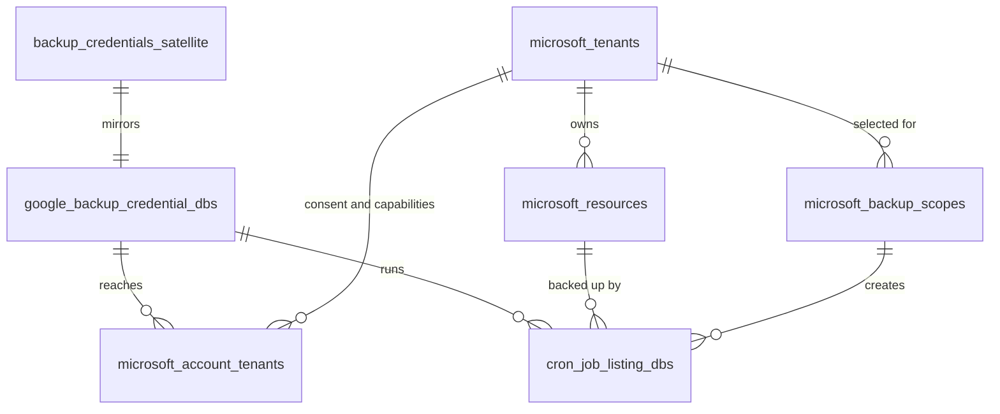
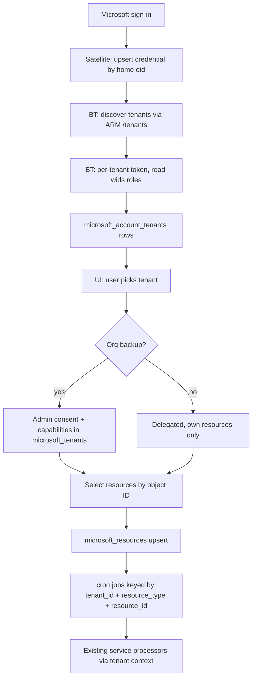

# Microsoft tenant and identity foundation

## Rules

- **Two kinds of identity, never mixed:**
  - *Credential identity* = `provider` + `home_tenant_id` + `external_account_id`. For Microsoft: `home_tenant_id` = `tid` and `external_account_id` = `oid` from the home-tenant sign-in. Microsoft gives the same person a different `oid` in each tenant, so `oid` alone is not globally unique. The database key can stay (`user_id`, `provider`, `external_account_id`) because `user_id` already scopes it. It only identifies who signed in and whose refresh token we hold.
  - *Microsoft identity* = `tenant_id` + `object_id` in that tenant (`microsoft_account_tenants.object_id`, `microsoft_resources.external_id`). This is what jobs, storage and restore use.
  - Email is only a display label.
- **Home tenant is not the selected tenant:**
  - `backup_credentials.tenant_id` means the home tenant only. Treat it as `home_tenant_id` in code: name variables and fields that way, and never use it as the current tenant.
  - The selected tenant always comes from `microsoft_account_tenants.tenant_id`, passed explicitly on every request.
- **Shared tables stay generic:** they get only provider-neutral columns (`provider`, `tenant_id`, `external_account_id`, `resource_id`). Google fills them too.
- **Microsoft-specific data goes in separate tables** linked by `credential_id` and `tenant_id`. We do not keep widening the shared tables.
- **One Microsoft sign-in is one credential.** Each tenant that sign-in can reach is a row linked to that credential, not another credential.
- **One resolver for tenant context.** Every handler, cron job and restore asks it for the credential, tenant link, consent, capabilities and token. No processor or handler calls `AuthTokenUsingRefreshToken`, `AuthTokenForTenant` or `AppOnlyToken` directly.
- **MTO / B2B are relationships, not a hierarchy.** StorX sees independent tenants, each with its own resources.
- **Never infer admin or access from a failure.** Unknown stays unknown.
- **Data is dev-only:** existing Microsoft jobs, credentials and backups are dropped. No dual paths, no data migration.

## What is done from this workspace

- **Only the Satellite (StorXMonitor) changes** are implemented here: the "Satellite" section, the contract below, and the todos above.
- **Backup-Tools and microsoft-storx UI are not edited from here.** Their sections below are the handoff spec for their own workspaces.
- The contract is the only coupling. Satellite can be built and tested before Backup-Tools implements its side:
  - the new headers are ignored by today's Backup-Tools;
  - the new proxy routes return whatever status Backup-Tools returns (404 until it ships them).

## Satellite to Backup-Tools contract

Satellite stores credentials. Backup-Tools owns tenants. Satellite never sends its own database IDs to Backup-Tools; the shared key is the Microsoft account itself.

- **Credential selection (UI to Satellite):** `credential_id` = Satellite `backup_credentials.id` (UUID).
  - Satellite checks the credential belongs to the session user.
  - If it's omitted and the user has exactly one Microsoft credential, that one is used.
  - Otherwise Satellite returns 400 `microsoft_credential_required`.
- **Tenant selection (UI to Satellite):** `tenant_id` = the selected Entra tenant GUID, passed through unchanged.
  - Satellite does not validate tenant membership; the Backup-Tools resolver does (the link must exist and be connected).
  - Satellite never substitutes the home tenant for a missing selected tenant on tenant-scoped routes; it returns 400 `tenant_id_required`.
- **Headers on every Microsoft call (Satellite to Backup-Tools):**
  - existing: `token_key`, `REFRESH_TOKEN` (stored refresh token, never a JWT);
  - new: `MICROSOFT_ACCOUNT_ID` (= `external_account_id`, the home `oid`);
  - new: `MICROSOFT_HOME_TENANT_ID` (= `backup_credentials.tenant_id`);
  - new: `MICROSOFT_TENANT_ID` (selected tenant; omitted on account-level routes such as tenant discovery).
  - Backup-Tools finds its credential by (`user_id` from `token_key`, `provider = microsoft`, `external_account_id`).
- **Request bodies:** the job-creation and quota-check bodies carry `tenant_id` = the selected tenant. Today `microsoft_backup_autosync.go` line 449 sends the credential's tenant, i.e. the home tenant; that changes.
- **Satellite routes and their Backup-Tools targets:**
  - `GET /api/v0/microsoft-backup/accounts`: Satellite-only. Lists the user's Microsoft credentials (`id`, `email`, `external_account_id`, `home_tenant_id`, `home_tenant_name`, `has_refresh_token`).
  - `GET /api/v0/microsoft-backup/tenants?credential_id=` → `GET /microsoft/accounts/tenants` (tenant access state list).
  - `POST /api/v0/microsoft-backup/tenants/{tid}/connect` → `POST /microsoft/accounts/tenants/{tid}/connect`, body `{backup_mode}`.
  - `POST /api/v0/microsoft-backup/tenants/{tid}/disconnect` → `POST /microsoft/accounts/tenants/{tid}/disconnect`.
  - `POST /api/v0/microsoft-backup/tenants/{tid}/roles/refresh` → `POST /microsoft/accounts/tenants/{tid}/roles/refresh`.
  - Existing tenant routes (`status`, `capabilities/refresh`, `directory/users`, `organization/structure`, `admin-consent-url`, `backup/onboarding/jobs`, browse, quota) keep their Backup-Tools paths and gain `credential_id` + `tenant_id`.
- **Responses:** passed through unchanged (tenant access state JSON as defined in this plan). Backup-Tools error codes (`tenant_not_linked`, `tenant_disconnected`, `consent_required`, `capability_denied`) are surfaced with Backup-Tools' HTTP status, as `BackupToolsStatusError` already does.

## Scope of this implementation

- **Implement Phase 1 only.**
- Don't modify or redesign existing Microsoft service processors, except where they must consume the new tenant context and storage key helper.
- Don't implement Phase 2 edge-case behaviour or add new Microsoft workloads.
- Existing Microsoft data is disposable dev data: drop and recreate the affected schema.
- **Golden rule:** credential, tenant, user, resource and job are separate entities. They are linked, never interchangeable.

**Order in this workspace (Satellite only):** schema, then identity at sign-in, then credential selection, then contract headers and selected tenant, then the new routes plus swagger, then tests.

**Overall order across all repos** (for reference; Backup-Tools and UI are done in their own workspaces, UI last):
1. Database schema (both repos).
2. Credential identity.
3. Tenant discovery.
4. Tenant links.
5. Tenant-specific token.
6. Role detection.
7. Consent + service principal.
8. Capability state.
9. Tenant context resolver.
10. Tenant-aware resources and jobs.
11. Storage keys.
12. Restore guard.
13. Satellite APIs.
14. UI tenant selection.
15. Tests (unit tests are written alongside each step; this step is the full run plus the two-tenant matrix).

## Work split by repo

The split follows ownership. Satellite owns StorX users and which Microsoft sign-ins they connected, and only proxies to Backup-Tools. Backup-Tools owns everything Microsoft-specific. Satellite never stores tenants, roles, consent, resources or jobs.

```mermaid
flowchart LR
    ui[microsoft-storx UI] -->|"credential_id + tenant_id"| sat[Satellite]
    sat -->|"proxy + token_key + credential"| bt[Backup-Tools]
    bt --> graph[Microsoft Graph / ARM / login]
    sat --- satDB[(backup_credentials)]
    bt --- btDB[("credentials, account_tenants, tenants, resources, jobs")]
```

### Satellite (StorXMonitor), about 1 day: implemented from this workspace

**Database (DBX):**
- `backup_credentials` in [satellite/satellitedb/dbx/oauth.dbx](satellite/satellitedb/dbx/oauth.dbx):
  - add `external_account_id` (text, nullable for old Google rows);
  - replace `unique user_id provider email` with `unique user_id provider external_account_id`;
  - `tenant_id` is read only as `HomeTenantID`.
- Regenerate with the `dbx-regenerate` skill and add the migration (Postgres, Cockroach, Spanner).
- Update [satellite/satellitedb/consoledb/backup_credentials.go](satellite/satellitedb/consoledb/backup_credentials.go): upsert by account, `GetByID`, `GetByUserIDProviderAndAccount`, `ListByUserIDAndProvider`.
- Google rows: `external_account_id` = Google `sub` when available, else the lowercased email. Google behaviour is unchanged.

**Service (`satellite/console`):**
- **Identity at sign-in:**
  - read `oid` and `tid` from the Microsoft id_token / access token and upsert by home `oid` ([microsoft_backup_connect.go](satellite/console/microsoft_backup_connect.go), [microsoft_backup_register.go](satellite/console/microsoft_backup_register.go));
  - `BackupCredential` gets `ExternalAccountID`;
  - a `HomeTenantID()` accessor wraps `TenantID`.
- **Credential selection:** new `resolveMicrosoftCredential(ctx, credentialID)` checks ownership, falls back to the only credential, and returns `microsoft_credential_required` when ambiguous. It replaces `GetByUserIDAndProvider(..., BackupProviderMicrosoft)` at:
  - [microsoft_backup_autosync.go](satellite/console/microsoft_backup_autosync.go) line 365;
  - [microsoft_backup_register.go](satellite/console/microsoft_backup_register.go) lines 141 and 197;
  - [microsoft_backup_workspace.go](satellite/console/microsoft_backup_workspace.go) lines 84 and 134;
  - the Microsoft branch of [backup_services_quota.go](satellite/console/backup_services_quota.go).
- **Contract headers:**
  - extend `backupToolsTenantJSON` / `backupToolsRequestWithHeaders` ([service.go](satellite/console/service.go) ~line 11527) with an options struct carrying `MICROSOFT_ACCOUNT_ID`, `MICROSOFT_HOME_TENANT_ID` and `MICROSOFT_TENANT_ID`;
  - Google calls are untouched.
- **Selected tenant:**
  - `microsoftOrgCredential` currently says "tenant ID always comes from the stored credential, never from the client". It becomes: credential from the stored row (ownership checked), selected tenant from the request (validated by the Backup-Tools resolver);
  - job and quota bodies send the selected `tenant_id`.

**HTTP API (`consoleweb`):**
- New routes under `/api/v0/microsoft-backup`:
  - `GET /accounts`;
  - `GET /tenants?credential_id=`;
  - `POST /tenants/{tid}/connect`;
  - `POST /tenants/{tid}/disconnect`;
  - `POST /tenants/{tid}/roles/refresh`.
- Existing Microsoft routes accept `credential_id` + `tenant_id` query/body params ([server.go](satellite/console/consoleweb/server.go) lines 663-699).
- Regenerate swagger (`scripts/generate_swagger.sh`).

**Tests (Spanner by default, per repo rules):**
- consoledb: upsert by `oid`, two Microsoft accounts for one user, uniqueness;
- service:
  - selection with 0, 1 or many credentials;
  - another user's `credential_id` is rejected;
  - an `httptest` Backup-Tools stub asserts the three headers and the body `tenant_id`;
  - the home tenant is never sent as `MICROSOFT_TENANT_ID` unless it was selected;
- consoleapi: the new routes require auth and pass parameters through.
- Google regression: existing Google credential create, lookup, quota check and Google Backup-Tools calls behave exactly as before; no Microsoft headers are sent on Google calls.

**Not in Satellite:** tenant discovery, roles, consent, capabilities, resources, jobs, storage keys, restore guard.

### Backup-Tools, about 2 days (handoff, implemented from the Backup-Tools workspace)

Contract obligations for Backup-Tools:
- read `MICROSOFT_ACCOUNT_ID`, `MICROSOFT_HOME_TENANT_ID` and `MICROSOFT_TENANT_ID`;
- find its credential by `external_account_id`;
- expose the `/microsoft/accounts/tenants` routes listed in the contract;
- return the error codes listed there.

Known bugs to fix in Backup-Tools as part of this:
- **Shared-resource jobs are named by display name:** `jobName := resolved.TeamName` / `SiteName` / `GroupName` in [handler/microsoft_onboarding.go](../StorxMonitor1/Backup-Tools/handler/microsoft_onboarding.go) lines 808, 869 and 933, and the current unique index includes `name`. Two teams with the same name collide, and the second is silently returned as "existing". Fixed by the new job identity (`tenant_id`, `resource_type`, `resource_id`, `method`); the name becomes a label only.
- **"All tenant" is a one-time snapshot:** `expandMicrosoftApplicationResources` lists teams, groups and sites only at onboarding. Onboarding with `all_users` / `backup_scope = all_tenant` now writes `microsoft_backup_scopes` rows with `selection_mode = all` (one per selected resource type), plus the initial jobs. A reconcile step on scheduled runs creates jobs for new resources and marks missing ones through the lifecycle check (see Data model).

Google safety (Google shares the jobs table, credential table and job helpers):
- **Migration order for `cron_job_listing_dbs`:** add the new columns with defaults, backfill existing rows (`provider = google`, `tenant_id = ''`, `resource_type = user`, `resource_id = name`), and only then drop `idx_name_sync_type_user` and create the new index, in one transaction. For Google the new index allows exactly the same jobs as the old one.
- **Credential defaults:** existing `google_backup_credential_dbs` rows get `provider = google` and `external_account_id = email` before the unique key changes.
- **Duplicate checks and lookups:** `checkExistingJobs`, `FindJobForUser` and `createSyncJob` keep matching Google jobs by `name`, including the Gmail placeholder skip. Microsoft resource jobs use a new lookup by (`tenant_id`, `resource_type`, `resource_id`, `method`, `sync_type`).
- **Restore:** `FindJobForRestore` keeps its name / `input_data.email` lookup for Google. The four-way tenant guard applies only to `provider = microsoft`.
- **Storage:** Google buckets, processors and keys are not touched.

**Database (GORM, [db/postgres.go](../StorxMonitor1/Backup-Tools/db/postgres.go) `Migrate()`):**
- `google_backup_credential_dbs`:
  - add `provider` and `external_account_id`, with new uniqueness;
  - move `microsoft_auth_mode` to the tenant link;
  - drop the unused `microsoft_app_client_id` / `_secret`.
- `cron_job_listing_dbs`: add `provider`, `tenant_id`, `resource_type`, `resource_id`, and the new unique index.
- `microsoft_tenants`: add `cloud`, `service_principal_id`, `availability`.
- New `microsoft_account_tenants` (link, role/token/discovery status, `connection_state`, `auth_mode`, `object_id`).
- New `microsoft_resources` with `UNIQUE(tenant_id, resource_type, external_id)`.
- New `microsoft_backup_scopes` (`tenant_id`, `resource_type`, `selection_mode`, …) for "all tenant" selection.

**apps/outlook (Microsoft clients):**
- `AuthTokenForTenant`.
- `CloudEndpoints`.
- ARM tenant discovery client.
- Per-tenant role reading with `scope`.
- Service principal lookup.
- `ResourceKeyPrefix` storage key helper.
- App secret expiry warning and `AADSTS7000222` handling.

**handler (tenant engine and API):**
- `ResolveMicrosoftTenantContext` and the Tenant Access State response.
- Endpoints:
  - `GET /microsoft/accounts/:credential_id/tenants`;
  - `POST .../tenants/:tid/connect`;
  - `POST .../tenants/:tid/disconnect`;
  - `POST .../tenants/:tid/roles/refresh`.
- Switch to the resolver: onboarding, workspace, directory, browse, quota precheck.
- Onboarding creates `microsoft_resources` rows and jobs keyed by tenant + resource.

**crons / tasks:**
- Outlook processors get the token from the resolver and write with `ResourceKeyPrefix`.
- Scheduled processors read the new prefixes.
- Lifecycle: 404 → deletedItems check → mark the resource, pause the job; tenant unavailable pauses jobs.

**restore:**
- Token from the resolver ([restore/microsoft/auth.go](../StorxMonitor1/Backup-Tools/restore/microsoft/auth.go)).
- Strict four-way tenant guard ([restore/auth.go](../StorxMonitor1/Backup-Tools/restore/auth.go)).
- Listing reads the new prefixes.

**Tests:**
- resolver;
- token authority;
- job uniqueness;
- access state;
- key helper;
- restore guard;
- lifecycle;
- scope reconcile (`all` adds a job for a new team, `selected` adds none, disconnected tenant creates nothing);
- Google migration (existing Google jobs and credentials backfilled, no duplicates allowed, lookups unchanged);
- service principal;
- scoped roles;
- no direct token calls.

### microsoft-storx UI, about 0.5-1 day (handoff, implemented from the UI workspace)

- Call `GET /microsoft-backup/accounts`, then `GET /microsoft-backup/tenants?credential_id=`, and send `credential_id` + `tenant_id` on every later Microsoft call.

- "Your tenants" step rendered from the Tenant Access State, including the discovery notice.
- Carry `credential_id` + `tenant_id` through [microsoftOrgService.ts](../StorxMonitor1/microsoft-storx/services/microsoftOrgService.ts), [jobService.ts](../StorxMonitor1/microsoft-storx/services/jobService.ts) and [ConnectAccountWizard.tsx](../StorxMonitor1/microsoft-storx/components/ui/ConnectAccountWizard.tsx).
- Select users by object ID (`user_ids`).
- Connect / disconnect actions; group jobs by tenant.

### Order across repos

1. Backup-Tools schema, then Satellite schema. They're independent, so they can be done in parallel.
2. Backup-Tools resolver and tenant endpoints, then Satellite proxies that pass `credential_id` / `tenant_id`.
3. Backup-Tools jobs, storage, restore and lifecycle.
4. UI.
5. Two-tenant testing.

Azure app registration (manual, once): add the delegated permission **Azure Service Management → `user_impersonation`** for tenant discovery.

## Microsoft feature decisions

Each feature is classified so the schema doesn't block it later. "Model now" means a column or state exists, but no feature work is done yet.

**Support now (Phase 1):**
- Entra tenant as the isolation boundary.
- `tenant_id` + `object_id` identity.
- Personal (MSA) vs work/school sign-in.
- One credential reaching many tenants.
- Tenant discovery (ARM `/tenants`).
- Tenant-specific tokens.
- Directory roles.
- Delegated vs application permissions.
- Per-tenant admin consent and service principal presence.
- Per-tenant capabilities, including license/service availability.
- Connect / disconnect / reconnect.
- Tenant-aware jobs, storage and restore.

**Model now, behaviour in Phase 2:**
- Guest / external member / home vs resource tenant (`category`, `user_type`, `home_tenant_id`).
- Role scope for administrative units (`roles[].scope`).
- MFA, Conditional Access, device-compliance and consent-policy blocks (`token_status`).
- User and group lifecycle (`state`).
- Tenant unavailable or deleted (`availability`).
- National clouds (`cloud`).

**Relationship only, never a hierarchy:**
- MTO, cross-tenant sync, cross-tenant access settings, B2B collaboration, B2B Direct Connect.
- Resource membership vs ownership: membership is never stored as ownership.

**Separate products later (not in this foundation):**
- Entra, Intune, Conditional Access and Purview configuration backup.
- Audit logs.
- Planner, OneNote, To Do, Lists and other P1 workloads.
- MTO tenant listing.
- Certificate-based app authentication (see app credential lifecycle).

## Data model



### Shared tables (small, generic changes)

**Satellite `backup_credentials`** ([satellite/satellitedb/dbx/oauth.dbx](satellite/satellitedb/dbx/oauth.dbx))
- Add `external_account_id`: the sign-in's home object ID (`oid`) for Microsoft, or the Google user ID. This is credential identity, not the tenant-scoped user identity.
- Unique key becomes (`user_id`, `provider`, `external_account_id`) instead of (`user_id`, `provider`, `email`).
- `tenant_id` stays in the database but means home tenant only. Satellite code exposes it as `HomeTenantID` and never uses it as the selected tenant.
- No Microsoft-only columns are added.

**Backup-Tools `google_backup_credential_dbs`** ([repo/google_backup_credential.go](../StorxMonitor1/Backup-Tools/repo/google_backup_credential.go))
- Add `provider` and `external_account_id`.
- Unique key becomes (`user_id`, `storj_project_id`, `provider`, `external_account_id`).
- Move `microsoft_auth_mode` out of this table into `microsoft_account_tenants.auth_mode`, because auth mode is per tenant.
- Drop `microsoft_app_client_id` and `microsoft_app_client_secret`. Organization backup uses only the platform multi-tenant app (`OUTLOOK_CLIENT_ID` / `OUTLOOK_CLIENT_SECRET`). Customer-provided apps can return later as their own table.

**Backup-Tools `cron_job_listing_dbs`** ([repo/cron_job_repository.go](../StorxMonitor1/Backup-Tools/repo/cron_job_repository.go))
- Add `provider`, `tenant_id`, `resource_type` and `resource_id`.
- Replace unique index `idx_name_sync_type_user` (`name`, `method`, `sync_type`, `user_id`) with (`user_id`, `provider`, `tenant_id`, `resource_type`, `resource_id`, `method`, `sync_type`).
- `method` (the service, for example outlook or onedrive) does not replace `resource_type`: a team and a group can share an ID, so both are stored.
- Google jobs use `provider = google`, `tenant_id = ''`, `resource_type = user` and `resource_id = email`, so behaviour is unchanged. `name` stays as the display label.
- Remove the unused `input_data["directory_user_id"]` ([handler/microsoft_onboarding.go](../StorxMonitor1/Backup-Tools/handler/microsoft_onboarding.go) line 654).

### Microsoft-only tables (Backup-Tools, GORM, registered in [db/postgres.go](../StorxMonitor1/Backup-Tools/db/postgres.go) `Migrate()`)

**`microsoft_tenants`** (exists; three small columns added)
- Already holds per-tenant consent, granted application roles and capabilities.
- Add `cloud`: `global` today; leaves room for `usgov`, `china`, etc.
- Add `service_principal_id`: the platform app's enterprise application object in that tenant, read after consent via `GET /servicePrincipals(appId='{clientId}')`.
  - A missing service principal means consent is not granted, whatever the cache says.
  - A present service principal alone never means consent is granted.
  - Organization backup is available only when all of these hold: service principal exists, application permissions are granted (`granted_roles` from the app-only token), `consent_status = granted`, the app-only token works, and the service's capability probe passes. `consent_status` stays the authoritative stored state.
- Add `availability`: available / unavailable / deleted, plus `availability_checked_at`. When the tenant's token endpoint returns tenant-not-found, mark it unavailable, pause its jobs and keep backups.

**`microsoft_account_tenants`** (new): tenants that are accessible / discoverable for a sign-in, and how
- Naming: these are "accessible tenants", not "member tenants". A tenant returned by ARM means Microsoft exposes it to this identity, not that the person is a directory member there. Membership is described only by `category` / `user_type`.
- Columns:
  - `credential_id` and `tenant_id` (primary key together). This is the only hard identity of a link;
  - plus a partial unique index `UNIQUE(tenant_id, object_id, credential_id) WHERE object_id IS NOT NULL` (raw SQL in the migration, since GORM tags can't express it). `object_id` stays NULL until known, and rows without it aren't constrained;
  - `tenant_name`, `default_domain`;
  - `object_id`: this person's object ID in that tenant;
  - `category`: home / guest / external_member / personal;
  - `user_type`, `home_tenant_id`;
  - `roles` (jsonb array of `{template_id, name, scope}`). `scope` is `/` for tenant-wide, or `/administrativeUnits/{id}` for a scoped role. Only tenant-wide admin roles count toward organization backup today; scoped roles are stored but not acted on yet;
  - `is_admin` (true only when `role_status = known` and a tenant-wide admin role is present);
  - `role_status`: known / unknown / signin_required / consent_required / error;
  - `token_status`: working / signin_required / consent_required / error, plus `token_error`;
  - `auth_mode`: delegated / application, i.e. how StorX authenticates;
  - `backup_mode`: personal / organization, i.e. what the user chose. Being allowed (admin + consent + working token) never switches this automatically;
  - `connection_state`: discovered / connected / disconnected (replaces a plain boolean), plus `connected_at` and `disconnected_at`;
  - `discovery_status`, on the home link only: complete / unavailable / permission_missing. When it isn't complete, the UI says "other tenants couldn't be discovered", never "this account has one tenant";
  - `checked_at`.

**`microsoft_resources`** (new): only resources selected for backup or seen by jobs, not the whole directory
- Columns:
  - `tenant_id`, `resource_type` (user / mailbox / drive / site / team / group), `external_id`, with `UNIQUE(tenant_id, resource_type, external_id)` (composite primary key). A team and its group can share one ID and are still separate rows;
  - `owner_external_id`: for service resources owned by a user (mailbox, drive), the owning user's object ID in the same tenant. It answers "whose OneDrive is this" without creating a second identity. Empty for user, site, team and group rows;
  - `display_name`, `mail`, `upn`, `user_type`, `home_tenant_id`;
  - `state`: active / disabled / deleted;
  - `deleted_at`, `last_seen_at`;
  - `metadata` (jsonb).
- Ownership is always `tenant_id`. Membership from another tenant never adds a resource to this tenant.

**`microsoft_backup_scopes`** (new): what should be backed up for a tenant, per resource type
- Scope answers "what should be backed up?"; a job answers "which resource is being backed up?".
- Columns:
  - `id`;
  - `user_id`, `storj_project_id`, `credential_id`, `tenant_id`;
  - `resource_type`: team / group / site (user and mailbox can be added later with the same shape);
  - `selection_mode`: selected / all;
  - `sync_type`, `policy_id` (schedule applied to jobs the scope creates);
  - `active`, `last_reconciled_at`, `reconcile_error`.
- Unique key: (`user_id`, `storj_project_id`, `tenant_id`, `resource_type`, `sync_type`).
- `selected`: the existing jobs are the selection. Reconcile never adds jobs and only runs the lifecycle check on the existing ones.
- `all`: reconcile lists the tenant's resources of that type, upserts `microsoft_resources`, creates a job for each resource without one, and marks missing resources through the lifecycle check (pause the job, keep backups).
- Jobs created by a scope store `scope_id` in `input_data`. Turning a scope from `all` to `selected` keeps existing jobs, and new resources simply stop being added.
- Example:

```text
tenant_id | resource_type | selection_mode
Tenant B  | team          | all
Tenant B  | group         | all
Tenant B  | site          | selected
```

- Jobs keep their own identity (`tenant_id`, `resource_type`, `resource_id`, `method`, `sync_type`), unchanged by the scope.
- Reconcile runs through `ResolveMicrosoftTenantContext`. A disconnected tenant, missing consent or missing capability skips the reconcile, records `reconcile_error`, and creates nothing.

### Tenant access state (computed, not a table)

Role, consent, token, capabilities and connection are separate facts. The resolver and the `GET .../tenants` API always return them together, never squeezed into `account_type`:

```json
{
  "tenant_id": "B", "tenant_name": "Contoso", "category": "home",
  "role":         {"status": "known", "roles": ["Global Administrator"], "is_admin": true},
  "consent":      {"status": "granted"},
  "token":        {"status": "working"},
  "capabilities": {"mail": true, "sharepoint": true, "teams": false},
  "connection":   {"state": "connected", "auth_mode": "application", "backup_mode": "organization"}
}
```

- **Sources:** role, token and connection come from `microsoft_account_tenants`; consent and capabilities come from `microsoft_tenants`.
- **`account_type`** stays only as a derived summary for existing UI code. New logic reads the access state.

## Tenant context resolver (the "tenant engine")

New package-level service in Backup-Tools, for example `handler/microsoft_tenant_context.go`:

```go
type MicrosoftTenantContext struct {
    Credential *repo.GoogleBackupCredentialDB
    Link       *repo.MicrosoftAccountTenantDB // must exist and be connected
    Tenant     *repo.MicrosoftTenantDB        // consent and capabilities
    Token      string                         // tenant-scoped, delegated or app-only
    Application bool
}
func ResolveMicrosoftTenantContext(ctx, db, userID string, credentialID uint, tenantID string) (*MicrosoftTenantContext, error)
```

- **Tenant-specific delegated tokens:** add `outlook.AuthTokenForTenant(refreshToken, tenantID)` in [apps/outlook/outlook-auth.go](../StorxMonitor1/Backup-Tools/apps/outlook/outlook-auth.go). It posts to `/{tenantID}/oauth2/v2.0/token`. Today every refresh goes to `/common`, which always returns a home-tenant token, so Tenant B could never be used.
- **Application mode** uses the existing `AppOnlyToken(ctx, tenantID)`, and only when the link's `auth_mode` is application and `microsoft_tenants.consent_status = granted`.
- **Callers that must switch to the resolver:**
  - onboarding ([handler/microsoft_onboarding.go](../StorxMonitor1/Backup-Tools/handler/microsoft_onboarding.go));
  - workspace and directory handlers;
  - browse handlers ([handler/microsoft_browse.go](../StorxMonitor1/Backup-Tools/handler/microsoft_browse.go));
  - Outlook cron processors (`crons/outlook_*_processor.go`);
  - restore token minting ([restore/microsoft/auth.go](../StorxMonitor1/Backup-Tools/restore/microsoft/auth.go));
  - quota precheck.
- **Fixed check order:**

```mermaid
flowchart LR
    handler[Handler or processor] --> cred[Credential belongs to user]
    cred --> link[Tenant link exists and connected]
    link --> consentCheck["Consent granted (application mode)"]
    consentCheck --> capCheck[Capability for requested service]
    capCheck --> token[Tenant-scoped token]
    token --> graph[Microsoft Graph]
```

- **Isolation guard:** the resolver rejects a request when:
  - the requested `tenant_id` has no connected link for that credential;
  - a job's `tenant_id` differs from its resource's `tenant_id`;
  - the token's `tid` claim differs from the requested tenant (defence in depth).
- **Enforcement:** a test greps that nothing outside the resolver calls the token functions.

## Flows



- **Personal accounts:**
  - identity type is an abstraction, `outlook.MicrosoftIdentityType` = `personal` / `work_school`;
  - `IsMSATenant` (`9188040d-...`) is used only inside the Microsoft identity layer to compute it, and the rest of the code checks the identity type;
  - a personal sign-in gets one link with category personal, delegated mode and `backup_mode = personal`. No consent or directory.
- **Role detection order:**
  - `wids` is only a fast-path hint for tenant-wide built-in roles, when present. Its presence depends on the app's `groupMembershipClaims` setting, so a missing `wids` never means "no role";
  - Graph role assignments (`/roleManagement/directory/roleAssignments?$filter=principalId eq '{oid}'`, with `directoryScopeId` `/` or `/administrativeUnits/{id}`) are the authoritative source for roles and scope, and the fallback. `/me/memberOf` directory roles are a secondary fallback;
  - if neither can be read, `role_status = unknown`.
- **Work/school user:** home link, delegated mode, own resources only.
- **Admin:**
  - roles come from the link's `roles`;
  - organization backup still requires per-tenant admin consent;
  - `admin_workspace` means consent is granted and the app token works for that tenant.
- **Guest / external member in Tenant B:**
  - a link with category guest or external_member and its own `object_id`;
  - organization backup of B needs B's admin consent;
  - delegated backup in B covers only what that object owns in B.
- **Tenant discovery:**
  - `GET https://management.azure.com/tenants?api-version=2022-12-01` with scope `https://management.azure.com/user_impersonation`;
  - requires adding the Azure Service Management delegated permission to the app registration;
  - if that fails, only the home tenant link is created and `discovery_status` records why (unavailable / permission_missing). The UI states explicitly that other tenants couldn't be discovered.
- **Conditional Access / MFA / consent blocks:**
  - a per-tenant token error sets `token_status` and `role_status` to signin_required or consent_required;
  - if a token works but roles can't be read, `role_status = unknown`;
  - the UI offers "sign in to this tenant" with authority `/{tenantId}`;
  - never guess roles, and never treat failure as admin.
- **MTO / cross-tenant sync:** not modelled as tables. Only `category`, `user_type` and `home_tenant_id` are stored. A tenant leaving an MTO changes nothing in StorX.
- **Lifecycle:** when a job gets 404 for a user or group, check `/directory/deletedItems/microsoft.graph.user` (or `.group`):
  - found there: mark the resource deleted and pause the job (`MessageStatus = warning`);
  - disabled user: mark disabled;
  - a restored object (same ID) reactivates;
  - backups are never deleted automatically.

## Relationships, licenses, app credentials, clouds, lifecycle

- **Three relationships, never merged:**
  - *Identity:* this person's object in each tenant (`microsoft_account_tenants`).
  - *Tenant:* MTO, cross-tenant sync and B2B are only metadata (`category`, `home_tenant_id`).
  - *Resource:* who owns a team, site or drive is `microsoft_resources.tenant_id`.
  - Example: a guest in B accessing Team B gives a link to B. It never puts Team B into Tenant A's backup.
- **License / service availability:** capabilities stay tenant-specific and come from the existing capability engine. It already tells "missing role" apart from "not provisioned", e.g. `MailboxNotEnabledForRESTAPI` ([apps/outlook/capabilities.go](../StorxMonitor1/Backup-Tools/apps/outlook/capabilities.go)). Per-user availability (no mailbox, no OneDrive) is recorded on the resource as `metadata.unavailable_services`, and that service is skipped instead of failing the job.
- **App credential lifecycle:**
  - one platform secret, read from env today;
  - add `OUTLOOK_CLIENT_SECRET_EXPIRES_AT` config and a startup/daily log warning 30 days before expiry;
  - on `AADSTS7000222` (expired secret), set every application-mode link to `token_status = error` with a clear message, instead of failing silently;
  - certificate authentication is a later swap inside `requestAppOnlyToken` ([apps/outlook/microsoft_app_auth.go](../StorxMonitor1/Backup-Tools/apps/outlook/microsoft_app_auth.go)) and needs no schema change.
- **Cloud environment:**
  - replace hardcoded hosts with one `outlook.CloudEndpoints{Login, Graph, ARM}` looked up from `microsoft_tenants.cloud` (`global` only for now);
  - the existing `graphBaseURL`, `microsoftLoginBaseURL` and `tokenURL` variables become fields of it;
  - the resolver passes the endpoints along with the token.
- **Disconnect:**
  - the link becomes `disconnected`;
  - its jobs are deactivated, and new jobs, browse and backup operations are blocked;
  - restore is also blocked: it requires the link to be connected, consistent with the resolver and the four-way restore guard. The user reconnects to restore;
  - existing backups are kept, and nothing is deleted.
- **Reconnect:** the same `(credential_id, tenant_id)` row goes back to `connected`. Existing `microsoft_resources` and jobs are reused because their IDs are unchanged.
- **Tenant unavailable/deleted:** `microsoft_tenants.availability = unavailable` or `deleted`, all jobs for that tenant pause, backups are kept under StorX retention. This is separate from deleting the StorX customer.

## Storage and restore

- **One standard key layout for every Microsoft object:** `{tenant_id}/{resource_type}/{resource_id}/...` inside the existing per-service buckets (`outlook`, `outlook-onedrive`, `outlook-sharepoint`, … in [satellite/satellite.go](../StorxMonitor1/Backup-Tools/satellite/satellite.go)). The bucket already names provider and service, so the full path reads as provider / service / tenant / resource type / resource.
  - Examples: `outlook/{tid}/user/{oid}/meta/...`, `outlook-sharepoint/{tid}/site/{siteId}/...`, `outlook-teams/{tid}/team/{teamId}/...`.
  - Build every key in one helper, `outlook.ResourceKeyPrefix(tenantID, resourceType, resourceID)`. It replaces the email prefix in `OutlookMailIDBasedMetaKey`, `OneDriveIDBasedMetaKey`, the calendar/contacts key functions, and the SharePoint/Teams/Groups key functions in [apps/outlook](../StorxMonitor1/Backup-Tools/apps/outlook).
- **Readers of these prefixes must change too:** scheduled processors (for example `tasks/scheduled_outlook_processor.go`, which uses `LoginId+"/"`), browse and restore listing.
- **Restore guard** in [restore/auth.go](../StorxMonitor1/Backup-Tools/restore/auth.go). It is mandatory with no exception. All four must be equal, or the restore is rejected:
  - the source cron job's `tenant_id`;
  - the source resource's `tenant_id`;
  - the restore target's selected tenant;
  - the write credential's connected tenant link.
- **Migration:** the existing migration path for Microsoft is blocked across tenants. Cross-tenant migration is added only later as a deliberate, separately designed feature.

## Satellite changes

- **DBX:**
  - add `external_account_id` and new uniqueness in [oauth.dbx](satellite/satellitedb/dbx/oauth.dbx);
  - regenerate with the `dbx-regenerate` skill;
  - add a migration;
  - update [satellite/satellitedb/consoledb/backup_credentials.go](satellite/satellitedb/consoledb/backup_credentials.go) (Create/Upsert by `external_account_id`, plus `GetByUserIDProviderAndAccount`).
- **Sign-in and register** ([satellite/console/microsoft_backup_connect.go](satellite/console/microsoft_backup_connect.go), [microsoft_backup_register.go](satellite/console/microsoft_backup_register.go)): read `oid` and `tid` from the token and upsert by home `oid`.
- **Replace "latest credential wins":** the 5 Microsoft call sites of `GetByUserIDAndProvider` take an optional `credential_id`, fall back to the only credential, and error when there are several and none was given:
  - [microsoft_backup_autosync.go](satellite/console/microsoft_backup_autosync.go) line 365;
  - `microsoft_backup_register.go` lines 141 and 197;
  - [microsoft_backup_workspace.go](satellite/console/microsoft_backup_workspace.go) lines 84 and 134.
- **New proxies** under `/api/v0/microsoft-backup` in [server.go](satellite/console/consoleweb/server.go):
  - `GET /accounts`: the user's Microsoft sign-ins;
  - `GET /tenants?credential_id=`: discovered tenants with roles and consent;
  - `POST /tenants/{tid}/connect`: mark the link connected;
  - `POST /tenants/{tid}/roles/refresh`.
- **Existing tenant routes** (`status`, `capabilities/refresh`, `directory/users`, `organization/structure`, `backup/onboarding/jobs`, browse) accept `tenant_id` + `credential_id` and pass them to Backup-Tools.
- Regenerate swagger with `scripts/generate_swagger.sh`.

## Backup-Tools endpoints

- `GET /microsoft/accounts/:credential_id/tenants`: run discovery and role checks, upsert links, return them.
- `POST /microsoft/accounts/:credential_id/tenants/:tid/connect`.
- `POST /microsoft/accounts/:credential_id/tenants/:tid/roles/refresh`.
- Existing `/microsoft/tenants/:tid/*` routes and onboarding take `credential_id` and go through the resolver.

## microsoft-storx UI

- **New wizard step "Your tenants"** after sign-in: a card per tenant rendered from the Tenant Access State (role, consent, token, capabilities, connection).
  - Unknown, sign-in-needed and consent-needed states are shown as such.
  - When discovery isn't complete, a notice says other tenants couldn't be discovered.
- The picked `tenant_id` + `credential_id` are carried through every later call ([services/microsoftOrgService.ts](../StorxMonitor1/microsoft-storx/services/microsoftOrgService.ts), [services/jobService.ts](../StorxMonitor1/microsoft-storx/services/jobService.ts), [components/ui/ConnectAccountWizard.tsx](../StorxMonitor1/microsoft-storx/components/ui/ConnectAccountWizard.tsx)).
- User selection sends `user_ids` (object IDs; onboarding already supports `req.UserIDs`) instead of emails.
- The dashboard groups jobs by tenant.

## Phases

- **Phase 1, foundation (this plan's todos):**
  - credentials and tenant links, discovery, tenant-specific tokens;
  - roles with scope, consent and service principal, capabilities and availability;
  - resolver and access state;
  - resource, job, storage and restore isolation;
  - disconnect and reconnect;
  - cloud endpoint abstraction (global only).
- **Phase 2, identity edge cases:**
  - guest and external-member behaviour, cross-tenant sync and MTO testing;
  - B2B Direct Connect shared channels;
  - administrative-unit scoped admins;
  - MFA / Conditional Access re-sign-in UX;
  - real-tenant testing of deleted / restored users and groups and of tenant deletion. The states and job pausing are already built in Phase 1;
  - per-service application permission differences:
    - Tenant A grants `Mail.Read`, `Sites.Read.All` and `Group.Read.All`; Tenant B grants only `Mail.Read`;
    - expected: A has Mail, SharePoint and Groups; B has Mail only, and its SharePoint and Groups show missing-role errors.
- **Existing workloads are not a separate phase.** Phase 1 already connects Mail, Calendar, Contacts, OneDrive, SharePoint, Teams and Groups to the resolver and storage-key helper, as far as tenant isolation requires. Their processing logic is otherwise unchanged; any later cleanup or refactoring is optional, not a scope.
- **Phase 3, new workloads:** Planner, OneNote, To Do, Lists, etc. as new `resource_type` values.
- **Phase 4, separate products:** configuration backup (Entra, Conditional Access, Intune, Purview, Defender, Power Platform).

## Verification

- **Unit tests:**
  - resolver: rejects a credential that belongs to another StorX user (checked before any tenant lookup), a tenant link that belongs to another credential, an unlinked or disconnected tenant, a tenant mismatch, and a token whose `tid` differs; picks delegated vs app-only;
  - Google regression (hard gate): an existing Google job keeps the same job identity after the schema change, runs the same processor, writes the same storage keys and restores the same way;
  - disconnected tenant: backup, browse and restore are all rejected until reconnect;
  - `AuthTokenForTenant` posts to the tenant authority;
  - job uniqueness: same email in two tenants, and the same ID with different resource types;
  - access state: failures yield unknown / signin_required, never admin; discovery failure is reported as unavailable;
  - storage key helper;
  - restore guard: each of the four tenant mismatches is rejected;
  - no direct token calls outside the resolver;
  - disconnect deactivates jobs and keeps objects; reconnect reuses the same rows;
  - missing service principal means consent is not granted; an unavailable tenant pauses its jobs;
  - scoped (administrative-unit) admin roles don't grant organization backup;
  - a present service principal alone doesn't make organization backup available;
  - roles fall back from `wids` to role assignments, and end as unknown when neither can be read;
  - `backup_mode` is never changed by access state;
  - mailbox and drive resources resolve to their owning user via `owner_external_id`;
  - Satellite credential upsert by `oid` (Spanner per repo rules).
- **Manual matrix on two real tenants (A, B):**
  - 1 user in 1 tenant, and 1 user in 2 tenants;
  - admin in A / member in B, and admin in both;
  - guest and external member;
  - A consented / B not;
  - different permissions per tenant;
  - same Team, Group and site name in A and B;
  - user disabled, deleted and restored;
  - Tenant A token, job and restore aimed at B must fail.